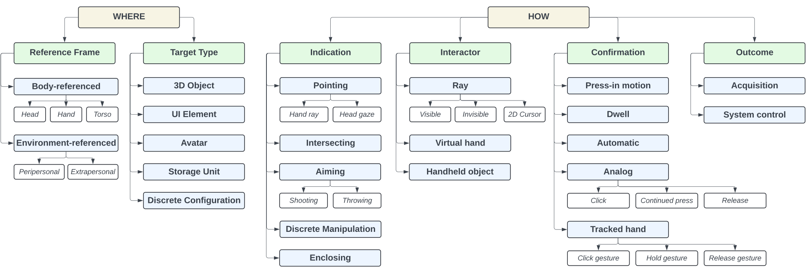

# Database of Selection Techniques in Consumer VR Applications

This [interactive database](https://www.eecs.ucf.edu/isuelab/research/vr_selections/) contains a taxonomy with examples and scenarios where selections occur in 200+ consumer VR applications. The goal of this work is to connect the research and literature on VR selection methodology with implementations in-practice. [The research paper](https://www.eecs.ucf.edu/isuelab/publications/pubs/MaslychISMAR2024.pdf) was presented at IEEE ISMAR 2024.



## Contributing to the database

Community contributions are welcome! Please open a pull request with changes to [data_website.csv](src/public/data_website.csv) file. After we review the changes and approve them, they will appear on the website.

## Citing

If you find this work useful, consider citing it:

```bibtex
@inproceedings{maslych2024selectionsdatabase,
      author = {Maslych, Mykola and Yu, Difeng and Ghasemaghaei, Amirpouya and
            Hmaiti, Yahya and Martinez, Esteban Segarra and Simon, Dominic and
            Taranta, Eugene Matthew and Bergstr"{o}m, Joanna and LaViola, Joseph J.},
      booktitle = {2024 IEEE International Symposium on Mixed and Augmented Reality (ISMAR)},
      title = {From Research to Practice: Survey and Taxonomy of Object Selection in Consumer VR Applications},
      url = {https://ieeeismar.org/full-program/},
      publisher = {IEEE},
      address = {Piscataway, NJ, USA},
      location = {Seattle, WA, USA},
      series = {ISMAR '24},
      pages = {1-10},
      month = {October},
      year = {2024},
}
```

## Development and deployment

Requires `node`, `yarn`.

### Installing dependencies

```bash
yarn install
```

### Development server

```bash
yarn dev
```

### Generate static pages

```bash
yarn generate
```

### Serve generated static pages to test locally

```bash
npx serve .output/public
```

### Deploy

```bash
scp -P PORT -r ./.output/public/ USER@IP:/home/www/website
```
